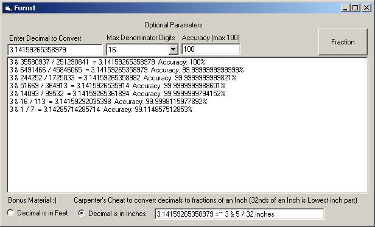



## FYI: Decimal To Fraction Conversion

### Description

A few posts recently on decimal&gt;fraction conversions &amp; thought I post a different approach. This one uses vector logic vs the brute force algorithms existing on this site. Enjoy. Patched to prevent negative values used in the Carpenter's Cheat routine.
 
### More Info
 

             |
---                |---
**Submitted On**   |2005-03-23 22:44:24
**By**             |[LaVolpe](https://github.com/Planet-Source-Code/PSCIndex/blob/master/ByAuthor/lavolpe.md)
**Level**          |Intermediate
**User Rating**    |4.7 (47 globes from 10 users)
**Compatibility**  |VB 5\.0, VB 6\.0
**Category**       |[Math/ Dates](https://github.com/Planet-Source-Code/PSCIndex/blob/master/ByCategory/math-dates__1-37.md)
**World**          |[Visual Basic](https://github.com/Planet-Source-Code/PSCIndex/blob/master/ByWorld/visual-basic.md)
**Archive File**   |[FYI\_\_Decim191080782005\.zip](https://github.com/Planet-Source-Code/lavolpe-fyi-decimal-to-fraction-conversion__1-61596/archive/master.zip)

